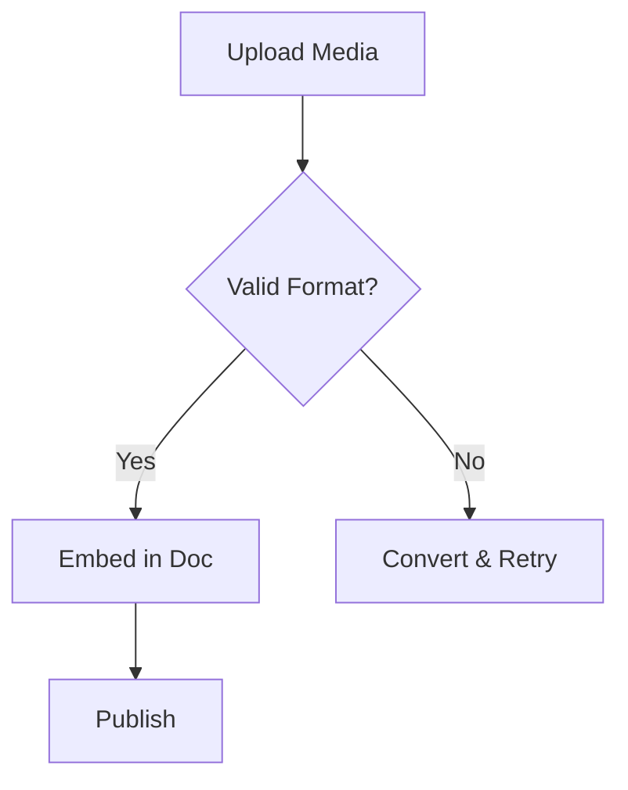

## Overview

JoinBoundless provides powerful features to help you organize, collaborate on, and enhance your documentation projects. You can structure content hierarchically, edit in real-time with teams, search efficiently, and embed rich media seamlessly.

<Columns cols={2}>
  <Card title="Organize Easily" icon="folder" href="#document-structuring">
    Create folders and nest documents for clear navigation.
  </Card>
  <Card title="Collaborate Live" icon="users" href="#real-time-collaboration">
    Edit documents simultaneously with your team.
  </Card>
  <Card title="Search Smart" icon="search" href="#search-filtering">
    Find content quickly with advanced filters.
  </Card>
  <Card title="Add Media" icon="image" href="#media-support">
    Embed images, videos, and attachments effortlessly.
  </Card>
</Columns>

## Document Structuring and Folders

Build a logical hierarchy for your documentation using folders and subfolders. You create a main folder for your project, then nest documents inside for better organization.

<Steps>
  <Step title="Create a Folder" icon="folder-plus">
    Navigate to your workspace and click the new folder button. Name it `{project-name}`.
  </Step>
  <Step title="Add Documents" icon="file-plus">
    Inside the folder, create new pages or upload existing files.
  </Step>
  <Step title="Nest Subfolders">
    Right-click a folder to create subfolders for deeper categorization, like `api/reference` or `guides/advanced`.
  </Step>
</Steps>

<Callout kind="tip">
  Use descriptive names for folders to improve navigation. Limit nesting to three levels for optimal performance.
</Callout>

## Real-time Collaboration Editing

Invite team members to edit documents live, with changes appearing instantly for all participants. Track edits and resolve conflicts easily.

<Tabs>
  <Tab title="Invite Collaborators" icon="user-plus">
    Share a document link or add emails via the collaborators panel. Set permissions to view, edit, or admin.
  </Tab>
  <Tab title="Live Editing" icon="edit-3">
    Multiple cursors show who is editing what. Use comments for feedback without altering content.
  </Tab>
</Tabs>

```javascript
// Example: Embed collaboration status in your app
const collabStatus = {
  activeUsers: 3,
  lastEdit: '2024-10-15T10:30:00Z',
  changes: [{ user: 'alice', line: 42 }]
};
```

## Search and Filtering Capabilities

Quickly locate content across your entire documentation space. Filter by tags, folders, or modification date.

| Filter Type | Description | Example |
|-------------|-------------|---------|
| Full Text | Searches titles and content | `api authentication` |
| Folder | Limits to specific folders | `in:guides` |
| Tags | Matches document tags | `tag:feature` |
| Date | Recent changes only | `modified:>2024-10-01` |

<Expandable title="Advanced Search Tips" default-open="false">
Combine filters like `api tag:breaking modified:>2024-09-01` for precise results. Save frequent searches as bookmarks.
</Expandable>

## Media and Attachment Support

Enhance documents with images, videos, and files. Drag-and-drop uploads support popular formats.

<CodeGroup tabs="Markdown,HTML">
```markdown


<Video src="https://example.com/video.mp4" width="600" height="400" />
```
```html


<video src="https://example.com/video.mp4" width="600" height="400" controls></video>
```
</CodeGroup>

<Callout kind="success">
  Supported formats: PNG, JPG, MP4, PDF up to 50MB. Use `{width}` and `{height}` attributes to prevent layout shifts.
</Callout>



These core features make JoinBoundless ideal for team documentation workflows. Explore [quickstart](/quickstart) to get started.